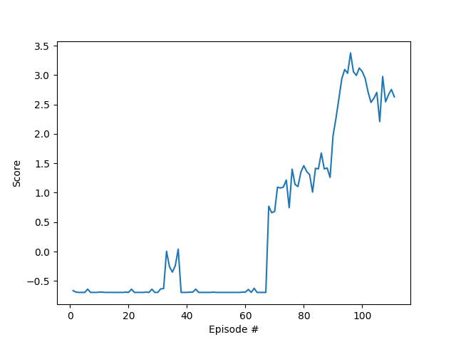

# Project report

## Multi Agent DDPG network architecture
As the input to the network is simply a 8 dimensional vector which represents the state space and as there is no spatial or temporal relation between it.

There is no point in CNNs. Thus we have used a simple four layer feedforward network for both the actor and the critic in the ddpg architecture with the following layer details.

Unlinke the other project the goal is to train both agents and perform well on both.


Actor:
(FC layer input: 8  Output: 256),
(FC layer input: 256  Output: 512)
(FC layer input: 512  Output: action_size)

Critic:
(FC layer input: action_size +512  Output: 256),
(FC layer input: 256  Output: 1)

The first layer of actor has relu and the final layer has tanh

Where as the first layer of Critic has relu, with dropout.

We have used batch normalizer for both actor and critic


- Max Steps for training: 111

## Results



```

Environment solved in 111 episodes! Average Score: 0.51020003
```

## Future Goals
## Test the enviornment in every way possible
### Value Based Learning-->

Extensive hyperparameter optimization
Double DQNs
Prioritized Experience Replay
Dueling Deep Q Networks
RAINBOW Paper
Learning from pixels
Try different Multi agent techniques and Adversarial losses

### Policy Based Learning ->

Tune Hyperparams
Better trade off between exploration and exploitation
PPO 
